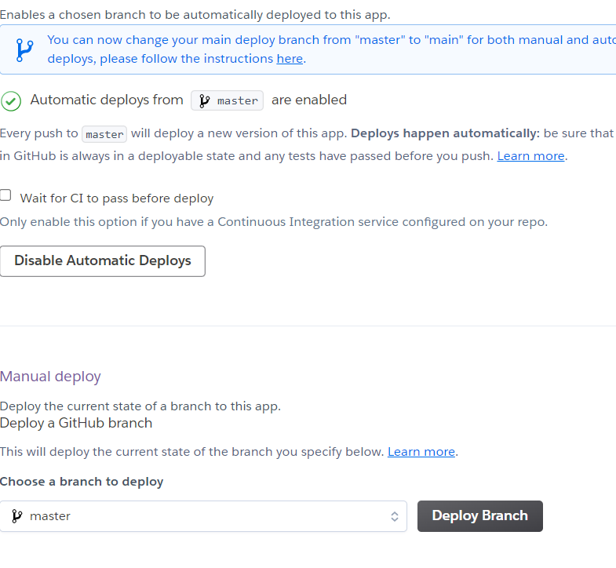

### Deploying a React App to Heroku 
1. create a github repo named heroku-app and type this in the directory you want to create a react app 
```bash 
cd heroku-app/
npx create-react-app . 
```
2. type this in git bash of the diretory 
```bash 
git init 
git remote add origin https://github.com/reem-shaikh/heroku-app.git
git add . 
git commit -m "added"
git pull 
git push -u origin master 
```
3. for testing, run react app on developer server 
```bash 
npm start 
```
4. create a heroku account and navigate to create new app
5. Adding a biuldpack
```bash 
What is a biuldpack?

biuldpacks tell the biuld process of the web app in which way should the file be created such that they can be delivered to the client in the most efficient way possible. 

Buildpacks provide framework and runtime support for apps. Buildpacks examine your apps to determine what dependencies to download and how to configure the apps. When you push an app, Cloud Foundry automatically detects an appropriate buildpack for it.
```
> copy this URL and paste it in the biuldpack URL in heroku testing app 
```bash 
https://github.com/mars/create-react-app-buildpack
```
6. connecting github repo to heroku app 
> Hover over to deploy in heroku and click on connect to github 

> enter you repo link and click on "enable automic deploy from Github" and click on deploy on master branch 


> Once the biuld is complete, heroku provides a link with which we can access our website, for instance, this is the link to this app.
https://herokutesting-app.herokuapp.com/
